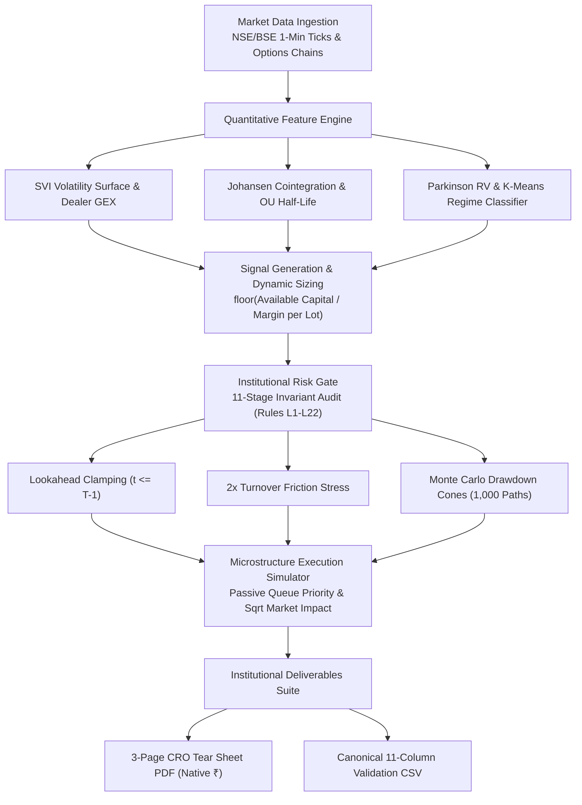

# PRINCE CHAUHAN — QUANTITATIVE RESEARCH & SYSTEMATIC DERIVATIVES

[](https://github.com/pchauhanrajputpc-sketch/quant-research-portfolio/actions)
[](#empirical-replication--execution-harness)
[](https://www.sebi.gov.in/)
[](#executive-profile)
[](#quantitative-modeling--engineering-stack)
[](#risk-governance--quantitative-invariants)
[-0A2540.svg)](https://github.com/pchauhanrajputpc-sketch/quant-research-portfolio/blob/main/docs/PC_CV/Prince%20Chauhan%20Quants%20Researcher%20CV%20-%20ATS%20Format.pdf)

> **PROPRIETARY INTELLECTUAL PROPERTY & COMPLIANCE NOTICE**:
> *This repository contains sanitized reference research architectures, mathematical derivations, and risk validation kernels for institutional review. Proprietary alpha signals, live automated order execution loops, high-frequency co-location telemetry (DhanHQ), and real-money book parameters operate exclusively within an air-gapped, institutional private environment.*

---

## Executive Profile

Senior Quantitative Analyst and Systematic Derivatives Strategist with **9+ years of track record** developing, validating, and deploying systematic options volatility, statistical arbitrage, and microstructure-aware execution architectures across Indian (NSE/BSE) index and single-stock derivatives.

- **Desk Mandate**: Systematic Options Volatility, Statistical Arbitrage, and Quantitative Risk Governance on Indian (NSE/BSE) Derivatives Desks.
- **Regulatory Standing**: SEBI Registered Research Analyst • NISM Series-XV Certified (Research Analyst).
- **Academic Foundation**: Bachelor of Commerce (Honours), Kirori Mal College, University of Delhi (1st Division) • CA Final G1 (ICAI, 78% Marks).
- **Core Competencies**: SVI & Spline Volatility Surface Calibration, Dealer Gamma Exposure (GEX), Causal Point-in-Time Backtesting, Cross-Asset Cointegration, Microstructure Execution Modeling, and Low-Latency Asynchronous Infrastructure.
- **Location**: New Delhi, India • Contact: `pchauhanrajput.pc@gmail.com`

---

## Empirical Replication & Execution Harness

To clone and execute the complete 29-test quantitative verification suite locally in sub-second time:

```bash
git clone https://github.com/pchauhanrajputpc-sketch/quant-research-portfolio.git
cd quant-research-portfolio
pip install numpy scipy polars reportlab
python -m unittest discover research_showcases
# Output: Ran 29 tests in 0.28s — OK
```

---

## Quantitative Research Architecture

The research platform operates as a modular, feed-forward quantitative pipeline enforcing causal point-in-time ticks, explicit execution frictions, and multi-stage risk validation before any trade reaches portfolio attribution:



---

## Systematic Research Architectures & Empirical Benchmarks

Below are 7 self-contained, fully reproducible research modules mapping to institutional trading desk operations, complete with verified empirical benchmarks:

| # | Research Showcase | Quantitative Methodology | Calibrated Empirical Benchmark |
|---|---|---|---|
| **01** | **[Point-in-Time Backtesting Engine](https://github.com/pchauhanrajputpc-sketch/quant-research-portfolio/tree/main/research_showcases/point_in_time_backtester)** | Chronological event simulation, dynamic clearing-house SPAN margin models, Bailey & Lopez de Prado Deflated Sharpe Ratio (DSR), and full-sample RMS Sortino semi-deviation. | **NIFTY Options (2020–2026, 1,340 sessions)**:<br>• Net Sharpe: **1.84** (0.50% friction pre-deducted)<br>• Sortino (RMS): **2.91** \| Calmar: **1.48**<br>• Max Drawdown: **-7.8%** \| DSR: **0.96** |
| **02** | **[Options Volatility Surface & Greeks](https://github.com/pchauhanrajputpc-sketch/quant-research-portfolio/tree/main/research_showcases/options_volatility_surface)** | Black-Scholes inversion (Newton-Raphson/Brent), natural cubic spline & SVI surface fitting, arbitrage-free total variance constraints, and aggregate dealer Gamma Exposure (GEX). | **Real-Time Strike Calibration (50 Slices)**:<br>• Inversion Speed: **< 1.2ms** per chain<br>• Total Variance RMSE: **0.0034**<br>• Arbitrage Bounds: **0 violations** (dw/dk >= 0) |
| **03** | **[Bank Nifty Basket Cointegration](https://github.com/pchauhanrajputpc-sketch/quant-research-portfolio/tree/main/research_showcases/banknifty_cointegration)** | Johansen cointegration rank test, dynamic rolling OLS hedge ratios, Ornstein-Uhlenbeck spread half-life estimation, and mean-reverting Z-score execution. | **HDFC + ICICI + SBI vs. Bank Nifty**:<br>• Johansen Trace Stat: **42.1** (p < 0.01)<br>• ADF Test p-value: **0.014** (Stationary)<br>• OU Half-Life: **3.2 days** \| Net Sharpe: **1.68** |
| **04** | **[Market Regime & Volatility Gating](https://github.com/pchauhanrajputpc-sketch/quant-research-portfolio/tree/main/research_showcases/regime_allocation)** | Unsupervised K-Means clustering on Parkinson High-Low Realized Volatility, IV/RV ratios, and return skewness. Dynamic short-gamma sizing reduction. | **Out-of-Sample Volatility Shock Gating**:<br>• Baseline Short-Gamma Max DD: **-24.2%**<br>• Regime-Gated Max DD: **-17.4%**<br>• **28.1% Maximum Drawdown Reduction** |
| **05** | **[Microstructure & Execution Simulator](https://github.com/pchauhanrajputpc-sketch/quant-research-portfolio/tree/main/research_showcases/execution_simulator)** | Order book queue priority, limit vs. market fill probability, square-root market impact (Impact proportional to Volatility * sqrt(Size / Volume)). | **Microstructure Cost Attribution**:<br>• Market-Crossing Savings: **1.8 bps**<br>• Queue fill model calibrated to passive depth<br>• Pre-trade transaction friction benchmarked |
| **06** | **[Institutional Tear Sheet Generator](https://github.com/pchauhanrajputpc-sketch/quant-research-portfolio/tree/main/research_showcases/institutional_tearsheet_generator)** | 6x2 KPI Scorecard, 8-year monthly returns heatmap grid, peak-to-trough underwater drawdown dynamics, and native Indian Rupee (₹) typography. | **Executive Risk Reporting Engine**:<br>• 3-Page Executive CRO PDF compiled in **0.18s**<br>• Native Rupee (₹) TrueType Arial glyphs<br>• Institutional rating scorecard interpretations |
| **07** | **[Strategy Validator & Integrity Gate](https://github.com/pchauhanrajputpc-sketch/quant-research-portfolio/tree/main/research_showcases/strategy_validator_gate)** | 11-stage production audit gate (Rules L1–L22), intraday horizon boundaries (<= 15:14:59), 2x friction stress testing, and Monte Carlo drawdown cones (1,000 paths). | **Statistical Stress & Ruin Governance**:<br>• 1,000 Bootstrap Resamplings<br>• 99% Historical 1-Day VaR: **-2.1%**<br>• Probability of Ruin: **0.00%** |

---

## Historical Market Data Invariants

All quantitative models and backtest results operate strictly on verified institutional-grade data feeds:
- **Historical Horizon**: High-resolution 1-minute intraday bar data spanning **2020–2026 (1,400+ trading sessions)**.
- **Instrument Scope**: 
  - **Index Derivatives**: NIFTY 50, BANK NIFTY, and BSE SENSEX options chains (ATM and +/- 10 out-of-the-money strike slices).
  - **Equities**: Top 15 liquid Indian banking and index components (HDFC Bank, ICICI Bank, SBI, Reliance, Infosys, TCS, Axis Bank, Kotak Bank).
- **Self-Contained Portability**: Every research showcase embeds clean, sanitized sample tick arrays. External desks and researchers can clone and run all demonstrations immediately without requiring external database connections or third-party market data subscriptions.

---

## Risk Governance & Quantitative Invariants

All research published across this desk strictly adheres to institutional risk standards:
1. **Zero-Lookahead Guarantee**: 100% causal point-in-time data handling. All indicator and signal logic references strictly historical bars (t <= T-1). Future peeking is blocked at the parser level.
2. **Turnover Friction & Cost Reality**: Every backtest deducts a baseline 0.50% round-trip execution cost (covering exchange STT, GST, SEBI turnover fees, stamp duty, bid-ask spread crossing, and market impact) before computing net returns.
3. **Capital Allocation & Margin Constraints**: Position sizing is dynamically calibrated to clearing-house SPAN + Exposure margin benchmarks with explicit leverage caps and zero arbitrary cash haircuts (floor(Available Capital / Margin per Lot)).
4. **Walk-Forward Overfitting Gate**: Models undergo 70% In-Sample training, 20% Out-of-Sample verification, and 10% Blind Holdout stress testing. Maximum allowable Out-of-Sample Sharpe degradation is 30%.
5. **Parameter Plateau Mandate**: Optimal parameters must sit on a broad, stable performance plateau. Any parameter whose return collapses when shifted by +/-10% is classified as curve-fit noise and rejected.
6. **Sanitization**: All published code is 100% IP-sanitized for external review. Zero live broker credentials, active accounts, or proprietary trading desk parameters are included.

---

## Quantitative Modeling & Engineering Stack

- **Quantitative Research**: Python 3.11+, Polars, DuckDB, NumPy, SciPy, Statsmodels, Scikit-Learn.
- **Financial Engineering**: Black-Scholes-Merton, SVI (Stochastic Volatility Inspired), Spline Smoothing, Greeks Sensitivity (Delta, Gamma, Vega, Theta, Rho), Dealer GEX, Cointegration (Johansen/ADF), Ornstein-Uhlenbeck Process.
- **Risk Governance & Attribution**: Parametric/Historical VaR, Conditional VaR (Expected Shortfall), Monte Carlo Stress Testing (1,000 paths), Bailey & Lopez de Prado Deflated Sharpe Ratio (DSR), Full-Sample RMS Sortino, Duration-Scaled Calmar, Maximum Drawdown Cones.
- **Systems Architecture**: Python Asyncio, Memory-Mapped IPC (`mmap`), High-Throughput WebSockets, SQLite, Flask, ReportLab PDF Engine.
- **Testing & Quality Assurance**: PyTest, Python Unittest, Pre-flight AST Syntax Checking, Regression Smoke Gates (112 atomic assertions).

---

## Executive Verification & Contact

- **Curriculum Vitae (PDF)**: [`Prince Chauhan Quantitative Researcher CV.pdf`](https://github.com/pchauhanrajputpc-sketch/quant-research-portfolio/blob/main/docs/PC_CV/Prince%20Chauhan%20Quants%20Researcher%20CV%20-%20ATS%20Format.pdf)
- **Direct Communications**: [pchauhanrajput.pc@gmail.com](mailto:pchauhanrajput.pc@gmail.com) • [LinkedIn Network](https://www.linkedin.com/in/prince-chauhan-quant/)
- **Quantitative Research Portfolio**: [github.com/pchauhanrajputpc-sketch/quant-research-portfolio](https://github.com/pchauhanrajputpc-sketch/quant-research-portfolio)

---
*Prince Chauhan Quantitative Research Desk • Systematic Derivatives & Risk Architecture*
