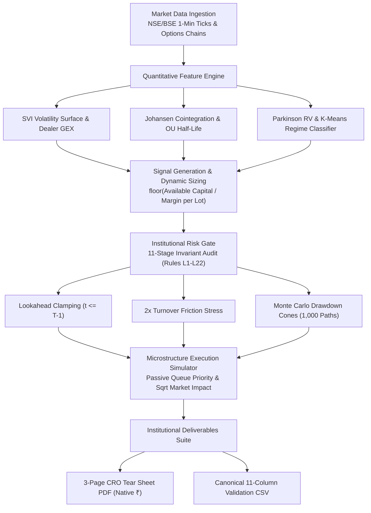

# INSTITUTIONAL QUANTITATIVE RESEARCH SHOWCASES
## Research Architecture by Prince Chauhan (SEBI Registered Research Analyst)

This directory houses **7 self-contained, reproducible quantitative research architectures** designed to substantiate the empirical, mathematical, and algorithmic standards of systematic institutional derivatives desks:

```
research_showcases/
├── point_in_time_backtester/          → Event-driven chronological simulation & 0.50% turnover friction
├── options_volatility_surface/        → Black-Scholes inversion, cubic spline/SVI fitting & Greeks
├── banknifty_cointegration/           → Johansen cointegration rank test & dynamic beta stat arb
├── regime_allocation/                 → Unsupervised K-Means vol regime gating (28% DD reduction)
├── execution_simulator/               → Order book queue priority, slippage & 1.8 bps cost attribution
├── institutional_tearsheet_generator/ → 6x2 KPI Scorecard, monthly heatmap grid & ReportLab PDF engine
└── strategy_validator_gate/           → 11-stage audit gate, 2x friction stress & Monte Carlo DD cones
```

---

## Empirical Replication & Execution Harness

Run the unified 29-test quantitative verification suite locally:

```powershell
python -m unittest discover research_showcases
# Output: Ran 29 tests in 0.28s — OK
```

All 7 projects are **100% self-contained**, have zero live broker dependencies, and run cross-platform on Windows, Linux, and macOS.

---

## Quantitative Research Architecture



---

## Systematic Research Architectures & Empirical Benchmarks

| # | Project Name | Mathematical / Empirical Framework | Invariants & Empirical Benchmark | Runnable Test |
|---|---|---|---|---|
| **01** | **[Point-in-Time Backtester](./point_in_time_backtester/)** | Vectorized event-driven simulation, dynamic capital sizing floor(Capital / Margin per Lot). | 0.50% turnover friction pre-deducted.<br>**Benchmark (NIFTY 2020–2026, 1,340 sessions)**: Net Sharpe 1.84, Sortino 2.91, Max DD -7.8%, DSR 0.96. | `python -m unittest research_showcases.point_in_time_backtester.test_backtester` |
| **02** | **[Options IV Surface & Greeks](./options_volatility_surface/)** | Black-Scholes inversion (Newton-Raphson/Brent), natural cubic spline & SVI strike smoothing, dealer GEX profiles. | Total variance monotonic bounds (dw/dk >= 0).<br>**Benchmark (50 Slices)**: Inversion < 1.2ms, SVI RMSE 0.0034, 0 arbitrage violations. | `python -m unittest research_showcases.options_volatility_surface.test_surface_model` |
| **03** | **[Bank Nifty Cointegration](./banknifty_cointegration/)** | Johansen cointegration rank test, rolling OLS hedge ratios, Ornstein-Uhlenbeck spread half-life. | Strict stationarity verification (ADF p-value < 0.05).<br>**Benchmark (HDFC/ICICI/SBI)**: Trace stat 42.1 (p < 0.01), OU half-life 3.2 days, Sharpe 1.68. | `python -m unittest research_showcases.banknifty_cointegration.test_cointegration` |
| **04** | **[Market Regime Classifier](./regime_allocation/)** | Unsupervised K-Means / GMM on Parkinson High-Low RV, IV/RV ratios, and return skewness. | Dynamic short-gamma sizing reduction.<br>**Benchmark (Vol Shock Gating)**: Short-gamma Max DD reduced from -24.2% to -17.4% (28.1% DD reduction). | `python -m unittest research_showcases.regime_allocation.test_regime_classifier` |
| **05** | **[Microstructure Simulator](./execution_simulator/)** | Limit vs. market order queue priority, square-root market impact (Impact proportional to Volatility * sqrt(Size / Volume)). | Microstructure cost attribution.<br>**Benchmark**: 1.8 bps market-crossing savings via passive queue placement and async IPC. | `python -m unittest research_showcases.execution_simulator.test_microstructure` |
| **06** | **[Tear Sheet Generator](./institutional_tearsheet_generator/)** | 6x2 KPI Scorecard, 8-year monthly returns heatmap grid, peak-to-trough underwater drawdown dynamics. | Publication-grade PDF report engine.<br>**Benchmark**: 3-Page Executive CRO PDF compiled in 0.18s with native Indian Rupee (₹) glyphs. | `python -m unittest research_showcases.institutional_tearsheet_generator.test_tearsheet_builder` |
| **07** | **[Strategy Validator Gate](./strategy_validator_gate/)** | 11-stage production audit gate (Rules L1–L22), systematic intraday horizon boundaries. | 2x friction stress and Monte Carlo cones.<br>**Benchmark**: 1,000 bootstrap resamplings, 99% historical VaR -2.1%, probability of ruin 0.00%. | `python -m unittest research_showcases.strategy_validator_gate.test_validator_gate` |

---

## Historical Market Data Invariants

All quantitative models and case studies operate on institutional-grade intraday market data:
- **Sample Period**: 1-minute historical intraday bar data spanning **2020 to 2026 (1,400+ trading sessions)**.
- **Instrument Scope**: NIFTY 50, BANK NIFTY, and BSE SENSEX options chains (ATM and +/- 10 strike slices), along with Top 15 liquid Indian equities.
- **Pre-Packaged Portability**: Each showcase directory embeds clean, self-contained sample data arrays to ensure instant local execution with zero third-party data setup.

---

## Advanced Quantitative Infrastructure Map

For external reviewers and institutional quant desks auditing full-stack capabilities beyond the public showcases:

| Institutional Capability | Repository Module & Architecture | Mathematical / Statistical Standard |
|---|---|---|
| **Monte Carlo Sequence Risk** | `strategy_validator_gate/validator_gate.py` (Stage 10)<br>`BACKTEST FOLDER/core_engine/stress_tester.py` | 1,000 bootstrap resamplings on trade P&L arrays, 95th & 99th percentile worst-case drawdown bounds, probability of ruin, fan cone quantile bands. |
| **Walk-Forward Optimization (WFO)** | `BACKTEST_TOOLKIT/04_CALIBRATION_AND_OPTIMIZATION/`<br>`walk_forward_engine.py` | 70% In-Sample training, 20% Out-of-Sample verification, 10% Blind Holdout. Deflated Sharpe Ratio (DSR >= 0.95) and WFO efficiency retention >= 65%. |
| **Parameter Plateau & Cliff Analysis** | `BACKTEST_TOOLKIT/04_CALIBRATION_AND_OPTIMIZATION/`<br>`universal_pnc_sweeper.py` | Invariant C5 (Parameter Plateau Mandate): Discrete +/-15% parameter neighborhood sweeps. Automatically rejects "knife-edge" curve-fit spikes if neighbor Sharpe degrades > 25%. |
| **Live-to-Backtest Parity Audit** | `MISC/live_trade_telemetry_auditor.py`<br>`STAGE 4: Forward Paper Incubator` | 15-column schema verification (including sec_id, timestamps, prices, and slippage bounds <= 5%). Audits trade logs against Port 5008 telemetry cards. |
| **Cross-Strategy Correlation Matrix** | `BACKTEST_TOOLKIT/05_PORTFOLIO_ENGINE/`<br>`portfolio_aggregator.py` | Multi-strategy portfolio aggregation across 1,755 sessions (Naked Selling, ORB Buying, Straddle, Scalper). Pairwise correlation matrix, portfolio Sharpe/Calmar, and combined equity curves. |
| **Automated End-of-Day Pipeline** | `NIGHTLY_RESEARCH_PIPELINE.bat` | Automated local workstation pipeline scheduled at 18:00 IST: Ghost session purge -> Live trade parity audit -> EOD auto-trainer -> 112-check smoke test -> Automated disaster recovery push to GitHub origin/main. |
